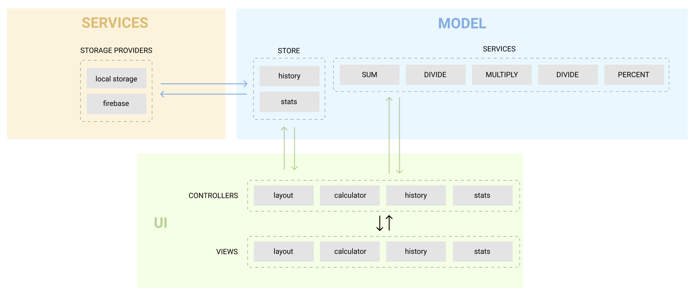

# IziPizi - You personal calculator

[Design specs in Figma](https://www.figma.com/file/7KCizfc2mU9GtmzBmcYFWn/Izipizi-Copy?node-id=0%3A1)

This project will remind you of everything you learnd so far, while encouraging you to
implement a SOLID architecture and get closer to the real world of professional
software development.

We will be much more organized now, with well-defined steps and rigidness.

## Leveraging the architecture

[View in figma](https://www.figma.com/file/J7ymhrHDASUOpXp2jHO2Dh/Architecture-chart)

This architecture above follows the MVC (Model, View, Controller) pattern. And each view, model, service and controller
must follow the [SOLID](https://pt.wikipedia.org/wiki/SOLID) principles.

### Views

Views are modules that take care of rendering the interface and listening to user-generated events. Views communicate with controllers.

### Controllers

Controllers serve as a bridge between the user interface (Views) and the business logic (Model). Controllers communicate with views and models.

### Models

Models are modules that take care of executing business logic, based on user input, received by controllers. Some Models also have the responsibility to save and retrieve data from storage.

Executing business logic AND dealing with storage would break the S principle of SOLID: Single responsibility. That's why Models need to communicate with storage services.

Models communicate with services and controllers
